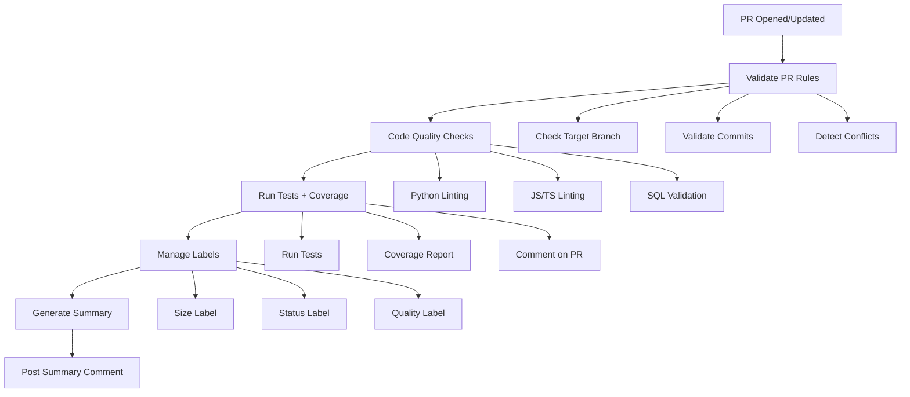

# 🤖 Agent d'implémentation de PR

## Vue d'ensemble

L'**Agent d'implémentation de PR** est un système automatisé conçu pour gérer et valider les Pull Requests dans le dépôt A'Space OS - Amiral. Il assure la qualité du code, le respect des conventions et facilite le processus d'intégration.

## 🎯 Fonctionnalités

### 1. Validation Automatique

#### Tests et Qualité
- ✅ Exécution automatique des tests existants
- ✅ Vérification de la syntaxe Python
- ✅ Rapport de couverture de code
- ✅ Validation de la structure du repository

#### Linting Multi-Langages
- **Python** :
  - `pylint` : Analyse statique et détection de bugs
  - `flake8` : Vérification de style PEP8
  - `black` : Formatage de code
  - `isort` : Organisation des imports
  
- **JavaScript/TypeScript** :
  - `ESLint` : Linting JavaScript (si configuré)
  - `Prettier` : Formatage (si configuré)
  
- **SQL (PL/pgSQL)** :
  - Validation de syntaxe basique
  - Détection de patterns SQL injection
  - Vérification des conventions de nommage

### 2. Vérification des Règles de Contribution

#### Politique des Branches
```
✅ develop ← feature/*, fix/*, docs/*
✅ main ← develop, hotfix/*, release/*
❌ main ← feature/* (BLOQUÉ)
```

**Règles :**
- Pas de PR directe vers `main` (sauf hotfix/release)
- Toutes les PRs de développement doivent cibler `develop`

#### Conventional Commits
Format requis : `type(scope): description`

**Types acceptés :**
- `feat` : Nouvelle fonctionnalité
- `fix` : Correction de bug
- `docs` : Documentation
- `style` : Formatage
- `refactor` : Refactoring
- `test` : Tests
- `chore` : Maintenance
- `perf` : Performance
- `ci` : CI/CD
- `build` : Build
- `revert` : Annulation

**Exemple :**
```
feat(pulse): add real-time KPI monitoring
fix(kernel): resolve file locking on Windows
docs(readme): update installation guide
```

### 3. Automatisation des Pré-requis de Merge

#### Détection de Conflits
- Simulation de merge en local
- Détection précoce des conflits
- Rapport détaillé des fichiers en conflit

#### Labeling Dynamique

**Labels automatiques :**
- `size/XS|S|M|L|XL` : Taille de la PR basée sur les changements
  - XS : < 10 lignes
  - S : 10-49 lignes
  - M : 50-199 lignes
  - L : 200-499 lignes
  - XL : 500+ lignes

- `ready-for-review` : Toutes les validations passées
- `needs-fixes` : Des corrections sont nécessaires
- `quality-checked` : Qualité du code vérifiée
- `deployment-ready` : Prêt pour le déploiement

#### Rapport de Couverture
- Génération automatique du rapport de couverture
- Commentaire sur la PR avec les statistiques
- Intégration Codecov (si configuré)

### 4. Déploiement Automatisé (Docker/VPS)

#### Validation Docker
- Linting des Dockerfiles avec `hadolint`
- Validation des fichiers `docker-compose.yml`
- Build de test des images Docker
- Scan de sécurité avec `Trivy`

#### Vérifications de Déploiement
- Présence de scripts de déploiement
- Configuration d'environnement (.env.example)
- Validation des images Docker
- Label `deployment-ready` si tout est OK

## 🔄 Workflow



## 📋 Workflows GitHub Actions

### 1. `pr-integration-agent.yml`
**Déclencheurs :** PR opened, synchronize, reopened, edited

**Jobs :**
1. `validate-pr-rules` : Validation des règles de contribution
2. `code-quality` : Vérifications de qualité multi-langages
3. `test-with-coverage` : Tests et couverture
4. `manage-labels` : Gestion des labels
5. `pr-summary` : Rapport récapitulatif

### 2. `docker-deployment.yml`
**Déclencheurs :** Modifications Docker-related

**Jobs :**
1. `validate-docker` : Validation configuration Docker
2. `deployment-readiness` : Vérification de la préparation au déploiement

## 🛠️ Configuration

### Fichiers de Configuration

#### Python
- `.pylintrc` : Configuration pylint
- `.flake8` : Configuration flake8
- `pyproject.toml` : Configuration black, isort, pytest, coverage

#### Git
- `.github/workflows/pr-integration-agent.yml` : Workflow principal
- `.github/workflows/docker-deployment.yml` : Workflow Docker
- `.github/PULL_REQUEST_TEMPLATE/` : Template de PR

### Installation Locale

```bash
# Installer les outils de développement Python
pip install pylint flake8 black isort pytest pytest-cov

# Linting
pylint your_file.py
flake8 .
black --check .
isort --check .

# Tests
pytest --cov=. --cov-report=html

# Docker
docker build -t test .
hadolint Dockerfile
```

## 📊 Rapports

### Rapport de PR
L'agent poste automatiquement un commentaire sur chaque PR :

```markdown
## 🤖 PR Integration Agent Report

### ✅ Validation Results

| Check | Status |
|-------|--------|
| Branch Rules | ✅ Passed |
| Code Quality | ⚠️ Issues Found |
| Tests | ✅ Passed |

### 📋 Next Steps

⚠️ Some checks require attention. Please review the failures above.
```

### Rapport de Couverture
```markdown
## 📊 Test Coverage Report

Coverage: 85%
Lines: 450/530
Branches: 89%
```

## 🚀 Utilisation

### Pour les Contributeurs

1. **Créer une branche** :
   ```bash
   git checkout -b feature/my-feature
   ```

2. **Faire des commits** (Conventional Commits) :
   ```bash
   git commit -m "feat(module): add new feature"
   ```

3. **Pousser et créer une PR** :
   ```bash
   git push origin feature/my-feature
   ```

4. **L'agent s'exécute automatiquement** :
   - Valide les règles
   - Vérifie la qualité
   - Lance les tests
   - Ajoute des labels
   - Poste un rapport

5. **Corriger si nécessaire** :
   - Lire les commentaires de l'agent
   - Corriger les issues
   - Push les corrections → l'agent se relance

### Pour les Reviewers

1. **Vérifier le rapport de l'agent** dans les commentaires
2. **Consulter les labels** pour comprendre l'état
3. **Reviewer le code** si tous les checks passent
4. **Approuver ou demander des changements**

## 🔒 Sécurité

### Permissions
- `contents: read` : Lecture du code
- `pull-requests: write` : Commentaires et labels
- `issues: write` : Gestion des labels
- `statuses: write` : Mise à jour des statuts

### Scans de Sécurité
- Analyse des Dockerfiles avec Trivy
- Détection de patterns SQL injection
- Vérification des dépendances

## 📚 Références

- [Guide de Contribution](../CONTRIBUTING.md)
- [Google Python Style Guide](https://google.github.io/styleguide/pyguide.html)
- [Conventional Commits](https://www.conventionalcommits.org/)
- [GitHub Actions](https://docs.github.com/en/actions)

## 🤝 Support

Pour toute question ou problème :
1. Consultez la [documentation](../README.md)
2. Vérifiez les [issues existantes](../../issues)
3. Créez une nouvelle issue si nécessaire

---

**Version:** 1.0.0  
**Dernière mise à jour:** 2026-01-21  
**Mainteneur:** A'Space OS Team
